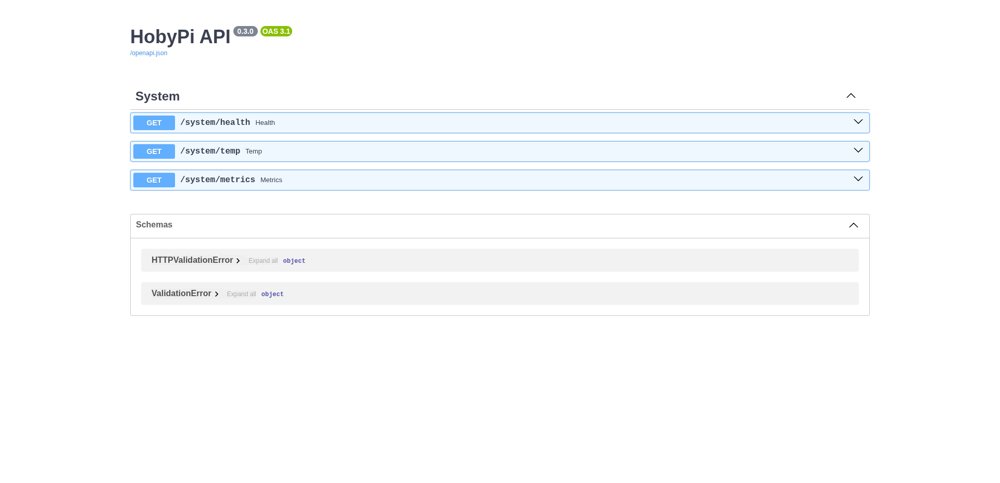

# HobyPi API Documentation



## Overview

The HobyPi API is a FastAPI-based backend that provides:

- 🖥️ **System Monitoring** - Real-time CPU temperature, system metrics, and health checks
- 🔐 **Authentication & Authorization** - JWT-based secure authentication with role-based access control
- 👥 **User Management** - Complete user CRUD operations with role assignments
- 📊 **Database Integration** - PostgreSQL with async SQLAlchemy and Alembic migrations
- 🛡️ **Security** - Bcrypt password hashing and OAuth2 scopes

## API Endpoints

### System Monitoring (Public Access)

#### `GET /`
- **Description**: API health check and version information
- **Response**: JSON with app name, version, and status

#### `GET /system/health`  
- **Description**: Basic system health check
- **Response**: `{"ok": true}`

#### `GET /system/temp`
- **Description**: CPU temperature and throttling status
- **Response**: Temperature in Celsius, throttling flags, and timestamp
- **Example Response**:
```json
{
  "time": "2025-10-01T12:00:00Z",
  "temp_c": 45.2,
  "throttled": "0x0",
  "throttled_flags": {
    "raw": "0x0",
    "undervoltage": {"active": false, "occurred": false},
    "freq_capped": {"active": false, "occurred": false},
    "throttled": {"active": false, "occurred": false},
    "soft_temp_limit": {"active": false, "occurred": false}
  }
}
```

#### `GET /system/metrics`
- **Description**: Comprehensive system metrics
- **Query Parameters**:
  - `sample_ms` (int, 0-2000): CPU sampling window in milliseconds (default: 200)
  - `top_n` (int, 0-20): Number of top processes to return (default: 5)
- **Response**: Detailed system information including CPU, memory, disk, network, and processes
- **Example Response**:
```json
{
  "time": "2025-10-01T12:00:00Z",
  "cpu": {
    "per_core": [25.0, 30.5, 22.1, 28.8],
    "avg": 26.6,
    "freq_mhz": [1500, 1500, 1500, 1500],
    "count": 4
  },
  "memory": {
    "total": 4294967296,
    "available": 2147483648,
    "used": 2147483648,
    "percent": 50.0
  },
  "temperature_c": 45.2,
  "top": [
    {"pid": 1234, "name": "python3", "cpu": 15.5, "rss": 104857600}
  ],
  "human": {
    "mem_used": "2.0 GiB",
    "mem_total": "4.0 GiB",
    "uptime_h": 24.5
  }
}
```

### Authentication

#### `POST /auth/login`
- **Description**: Authenticate user and receive JWT token
- **Request Body**:
```json
{
  "identifier": "admin",  // username or email
  "password": "letmein"
}
```
- **Response**:
```json
{
  "access_token": "eyJ0eXAiOiJKV1QiLCJhbGciOiJIUzI1NiJ9...",
  "token_type": "bearer",
  "expires_in": 3600,
  "scope": "admin system:read users:read users:write"
}
```

#### `GET /auth/me`
- **Description**: Get current user profile
- **Authentication**: Required (Bearer token)
- **Response**:
```json
{
  "id": 1,
  "username": "admin",
  "email": "admin@local",
  "full_name": "HobyPi Administrator",
  "roles": ["admin"],
  "is_active": true
}
```

### User Management (Requires Authentication)

#### `GET /users`
- **Description**: List all users
- **Authentication**: Required (Bearer token)
- **Required Scopes**: `users:read`
- **Response**: Array of user objects

#### `POST /users`
- **Description**: Create new user
- **Authentication**: Required (Bearer token)
- **Required Scopes**: `users:write`
- **Request Body**:
```json
{
  "username": "newuser",
  "email": "user@example.com",
  "full_name": "New User",
  "password": "securepassword"
}
```

## Authentication & Authorization

### JWT Token Structure

The API uses JWT tokens with the following claims:
- `sub`: User ID
- `email`: User email address  
- `scope`: Space-separated list of permissions
- `iss`: Token issuer ("hobypi")
- `aud`: Token audience ("hobypi-clients")
- `exp`: Expiration timestamp
- `iat`: Issued at timestamp

### OAuth2 Scopes

- `users:read` - Read user profiles and lists
- `users:write` - Create, update, and delete users
- `admin` - Administrative actions
- `system:read` - Read system metrics (assigned to all roles)

### Roles

#### Viewer
- **Scopes**: `users:read`, `system:read`
- **Description**: Can view user profiles and system metrics

#### Editor  
- **Scopes**: `users:read`, `users:write`, `system:read`
- **Description**: Can manage users and view system metrics

#### Admin
- **Scopes**: `users:read`, `users:write`, `admin`, `system:read`
- **Description**: Full access to all endpoints and administrative functions

## Database Schema & Migration Management with Alembic

The HobyPi API uses **Alembic** for database schema versioning and migrations. Alembic is SQLAlchemy's database migration tool that provides:

- **Version Control** for database schema changes
- **Automatic Migration Generation** from model changes
- **Rollback Capabilities** to previous schema versions
- **Production-Safe Deployments** with incremental updates

### How Alembic is Implemented in HobyPi

#### 1. **Directory Structure**
```
apps/fastapi-app/
├── alembic.ini              # Alembic configuration file
├── alembic/                 # Migration environment
│   ├── env.py              # Migration environment setup
│   ├── script.py.mako      # Migration script template
│   └── versions/           # Individual migration files
│       └── 0001_init.py    # Initial schema migration
├── app/
│   ├── models/             # SQLAlchemy ORM models
│   │   ├── user.py        # User model definition
│   │   ├── role.py        # Role model definition
│   │   └── base.py        # Shared model components
│   └── core/
│       ├── db.py          # Database connection setup
│       └── bootstrap.py   # Auto-migration on startup
```

#### 2. **Configuration (`alembic.ini`)**
The Alembic configuration specifies:
- **Script Location**: Where migration files are stored
- **Database URL**: Connection string (dynamically set from environment)
- **Migration Template**: How new migration files are generated
- **Logging Configuration**: Migration execution logging

#### 3. **Environment Setup (`alembic/env.py`)**
This file configures:
- **Target Metadata**: Links to SQLAlchemy models for auto-generation
- **Database Connection**: Uses settings from `app.core.config`
- **Migration Context**: Handles both online and offline migrations
- **Transaction Management**: Ensures migrations are atomic

#### 4. **Automatic Migration on Startup**
The `app.core.bootstrap.py` module automatically:
```python
def run_migrations_to_head() -> None:
    """Run all pending migrations to bring database to latest version"""
    cfg = Config("alembic.ini")
    cfg.set_main_option("sqlalchemy.url", settings.db_url_sync)
    command.upgrade(cfg, "head")  # Upgrade to latest migration
```

This ensures that:
- **New Deployments** automatically get the latest schema
- **Updates** apply any pending migrations on restart
- **Development** stays in sync without manual intervention

### Database Schema

#### Users Table
```sql
CREATE TABLE users (
    id SERIAL PRIMARY KEY,
    username VARCHAR(64) UNIQUE NOT NULL,
    email VARCHAR(255) UNIQUE NOT NULL,
    full_name VARCHAR(120) NOT NULL,
    password_hash VARCHAR(255) NOT NULL,
    is_active BOOLEAN DEFAULT true,
    created_at TIMESTAMP WITH TIME ZONE DEFAULT now(),
    updated_at TIMESTAMP WITH TIME ZONE DEFAULT now()
);

-- Indexes for performance
CREATE UNIQUE INDEX ix_users_username ON users(username);
CREATE UNIQUE INDEX ix_users_email ON users(email);
```

#### Roles Table
```sql
CREATE TABLE roles (
    id SERIAL PRIMARY KEY,
    name VARCHAR(50) UNIQUE NOT NULL,
    scopes VARCHAR(255) DEFAULT 'users:read',
    created_at TIMESTAMP WITH TIME ZONE DEFAULT now(),
    updated_at TIMESTAMP WITH TIME ZONE DEFAULT now()
);

-- Index for role lookups
CREATE UNIQUE INDEX ix_roles_name ON roles(name);
```

#### User Roles Junction Table
```sql
CREATE TABLE user_roles (
    user_id INTEGER REFERENCES users(id) ON DELETE CASCADE,
    role_id INTEGER REFERENCES roles(id) ON DELETE CASCADE,
    PRIMARY KEY (user_id, role_id)
);
```

### Migration Workflow

#### 1. **Making Model Changes**
When you modify SQLAlchemy models in `app/models/`, follow these steps:

```python
# Example: Adding a new field to User model
class User(TimestampMixin, Base):
    __tablename__ = "users"
    # ... existing fields ...
    phone_number: Mapped[str] = mapped_column(String(20), nullable=True)  # New field
```

#### 2. **Generating Migrations**
Create a new migration to capture the changes:

```bash
# From the fastapi-app directory
cd ~/HobyPi/apps/fastapi-app
source .venv/bin/activate

# Generate migration automatically
alembic revision --autogenerate -m "Add phone number to users"

# Or from the root directory using make
make db-revision MSG="Add phone number to users"
```

This creates a new file like `alembic/versions/0002_add_phone_number_to_users.py`:

```python
"""Add phone number to users

Revision ID: 0002_add_phone
Revises: 0001_init
Create Date: 2025-10-01 12:00:00
"""
from alembic import op
import sqlalchemy as sa

# revision identifiers
revision = '0002_add_phone'
down_revision = '0001_init'
branch_labels = None
depends_on = None

def upgrade() -> None:
    # Add the new column
    op.add_column('users', sa.Column('phone_number', sa.String(20), nullable=True))

def downgrade() -> None:
    # Remove the column (for rollbacks)
    op.drop_column('users', 'phone_number')
```

#### 3. **Applying Migrations**
Apply the migration to update your database:

```bash
# Manual application
alembic upgrade head

# Or using make command
make db-migrate

# Or simply restart the API (auto-applies on startup)
make api-restart
```

#### 4. **Migration Verification**
Check migration status:

```bash
# Check current migration version
alembic current

# Show migration history
alembic history

# Show pending migrations
alembic heads
```

### Production Migration Strategy

#### 1. **Pre-Deployment Testing**
Before deploying to production:

```bash
# Test migration on a copy of production data
alembic upgrade head --sql > migration.sql  # Generate SQL
# Review the SQL before applying
psql -f migration.sql  # Apply to test database
```

#### 2. **Zero-Downtime Deployments**
For production deployments:

1. **Backward-Compatible Changes**: Add nullable columns, new tables
2. **Deploy Application**: New code can handle both old and new schema
3. **Run Migration**: Apply schema changes
4. **Data Backfill**: Populate new fields if needed
5. **Cleanup**: Remove old code paths after verification

#### 3. **Rollback Strategy**
If issues occur:

```bash
# Rollback to previous migration
alembic downgrade -1

# Rollback to specific version
alembic downgrade 0001_init

# Check what the rollback will do first
alembic downgrade -1 --sql
```

### Common Migration Scenarios

#### Adding a New Table
```python
# 1. Create the model in app/models/
class Setting(TimestampMixin, Base):
    __tablename__ = "settings"
    id: Mapped[int] = mapped_column(Integer, primary_key=True)
    key: Mapped[str] = mapped_column(String(100), unique=True)
    value: Mapped[str] = mapped_column(Text)

# 2. Generate migration
make db-revision MSG="Add settings table"

# 3. Apply migration
make db-migrate
```

#### Modifying Existing Columns
```python
# 1. Update the model
class User(TimestampMixin, Base):
    # Change username length from 64 to 100
    username: Mapped[str] = mapped_column(String(100), unique=True, nullable=False)

# 2. Generate and apply migration
make db-revision MSG="Increase username length"
make db-migrate
```

#### Adding Indexes
```python
# In migration file
def upgrade() -> None:
    op.create_index('ix_users_full_name', 'users', ['full_name'])

def downgrade() -> None:
    op.drop_index('ix_users_full_name', table_name='users')
```

### Automatic System Updates

The HobyPi API automatically handles schema updates through:

#### 1. **Startup Migration Hook**
Every time the API starts:
```python
@app.on_event("startup")
async def _on_startup():
    await bootstrap_on_startup()  # Runs migrations automatically
```

#### 2. **Bootstrap Process**
The bootstrap function:
1. **Checks Current Schema Version**
2. **Applies Pending Migrations** 
3. **Seeds Default Data** (roles, admin user)
4. **Validates Database Connection**

#### 3. **Development Workflow**
For developers:
```bash
# Pull latest code with new migrations
git pull origin main

# Start API (automatically applies migrations)
make api-start

# Verify schema is updated
make db-status
```

#### 4. **Production Deployment**
For production deployments:
```bash
# Option 1: Automatic (recommended for small changes)
systemctl restart hobypi-api  # Migrations run on startup

# Option 2: Manual (recommended for major changes)
sudo -u hobypi /path/to/venv/bin/alembic upgrade head
systemctl restart hobypi-api
```

### Migration Best Practices

#### 1. **Always Review Generated Migrations**
```bash
# After generating, review the migration file
alembic revision --autogenerate -m "Description"
# Edit alembic/versions/XXXX_description.py if needed
```

#### 2. **Test Migrations Thoroughly**
```bash
# Test forward migration
alembic upgrade head

# Test rollback capability  
alembic downgrade -1
alembic upgrade head
```

#### 3. **Use Descriptive Messages**
```bash
# Good migration messages
make db-revision MSG="Add user profile pictures"
make db-revision MSG="Create audit log table"
make db-revision MSG="Add indexes for performance"

# Avoid generic messages
make db-revision MSG="Update database"  # Too vague
```

#### 4. **Handle Data Migrations**
For complex data changes:
```python
def upgrade() -> None:
    # Schema change
    op.add_column('users', sa.Column('status', sa.String(20), default='active'))
    
    # Data migration
    connection = op.get_bind()
    connection.execute("UPDATE users SET status = 'active' WHERE is_active = true")
    connection.execute("UPDATE users SET status = 'inactive' WHERE is_active = false")
```

### Troubleshooting Migrations

#### Common Issues and Solutions

**1. Migration Conflicts**
```bash
# If multiple developers create migrations simultaneously
alembic merge heads -m "Merge conflicting migrations"
```

**2. Schema Out of Sync**
```bash
# Mark current schema as up-to-date without running migrations
alembic stamp head
```

**3. Database Connection Issues**
```bash
# Check database connectivity
make db-status

# Verify environment variables
grep DATABASE_URL .env
```

**4. Rolling Back Problematic Migrations**
```bash
# Show migration history
alembic history

# Rollback to specific version
alembic downgrade <revision_id>
```

This comprehensive migration system ensures that your HobyPi database schema stays in sync across development, testing, and production environments while providing safety mechanisms for rollbacks and recovery.

## Error Responses

### Authentication Errors
- **401 Unauthorized**: Invalid or missing token
- **403 Forbidden**: Insufficient permissions

### Validation Errors  
- **400 Bad Request**: Invalid request data
- **422 Unprocessable Entity**: Validation errors

### Example Error Response
```json
{
  "detail": "Could not validate credentials"
}
```

## Interactive Documentation

When the API is running, interactive documentation is available at:
- **Swagger UI**: http://localhost:8000/docs
- **ReDoc**: http://localhost:8000/redoc

## Testing Examples

### Using curl

```bash
# Get system health
curl http://localhost:8000/system/health

# Login and save token
TOKEN=$(curl -s -X POST "http://localhost:8000/auth/login" \
  -H "Content-Type: application/json" \
  -d '{"identifier": "admin", "password": "letmein"}' | \
  jq -r '.access_token')

# Get current user
curl -H "Authorization: Bearer $TOKEN" \
  http://localhost:8000/auth/me

# List users
curl -H "Authorization: Bearer $TOKEN" \
  http://localhost:8000/users
```

### Using the Makefile

```bash
# Test system endpoints
make test-api

# Test authentication flow  
make test-auth

# Check database status
make db-status
```

## Security Considerations

1. **Change Default Credentials**: Update the default admin password in production
2. **JWT Secret**: Use a strong, random JWT secret key
3. **HTTPS**: Enable HTTPS in production environments
4. **CORS**: Configure appropriate CORS origins
5. **Database Security**: Use proper PostgreSQL authentication and network security
6. **Rate Limiting**: Consider implementing rate limiting for production use
7. **Input Validation**: All inputs are validated using Pydantic schemas
