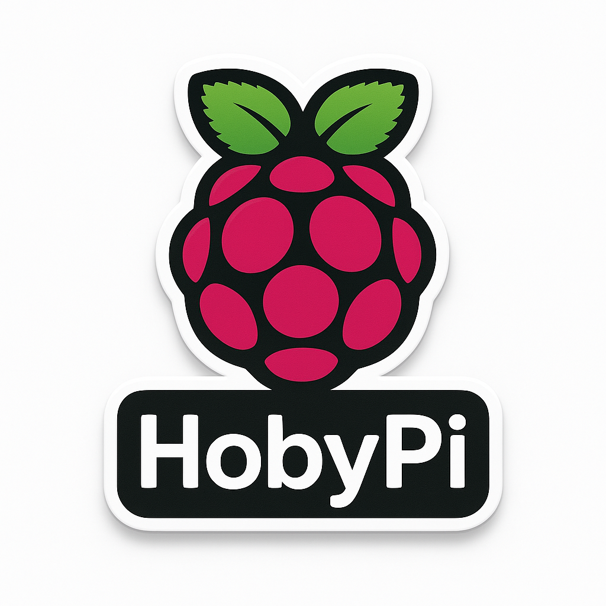

# HobyPi: Turning My Raspberry Pi Experiments into a Home Control Playground

I'm a Python developer who has always admired the openness of Linux, the generosity of the open-source community, and the magic of custom hardware. For years I promised myself that I'd carve out time to explore hardware properly--and that the project I built would give something back. HobyPi is that promise finally kept: my Raspberry Pi hobby, wrapped in tools I love, and shared so others can learn with me.

## Why I Finally Built HobyPi
My day job is Python, but my curiosity stretches into every blinking LED. I've spent years on the command line, and the moment I unboxed a Raspberry Pi I knew I wanted more than a "hello world" LED blink. I wanted a purpose-built playground where I could iterate, break things, and still deliver something useful to fellow tinkerers. That itch for personal-purpose hardware, plus the desire to contribute to open source, pushed HobyPi into existence.

## From Wishful Thinking to a Working Stack
Buying the Pi had been on my wish list forever; once it arrived I spent a month of late evenings reinventing my hobby. Rome wasn't built in a day and neither was this project, but every small session layered another brick: wiring up the backend, shaping a frontend, and refining the tooling so anyone can bootstrap the stack quickly. HobyPi is the point where my love for Python, Linux, and DIY hardware finally intersect.

## Architecture I Can Grow With
### FastAPI brain
The backend runs on FastAPI with an async PostgreSQL core, JWT authentication, and role-based access. On startup it migrates the database, seeds admin and viewer accounts, and exposes system and user endpoints--so the Pi is ready to monitor itself the moment the service boots.

### React control center
The React dashboard is the face of HobyPi. After login, you land on a control center that refreshes CPU, temperature, memory, disk, and throttle data every few seconds. From there you can dive into focused modules: a home-control prototype with room cards and scenes, camera management mockups, bills analytics with charts, a calendar packed with UK and Indian holidays, and a todo list that filters, prioritizes, and tracks overdue tasks. They're UI-first today, but built to be wired into real hardware and automations next.

### Pi-native tooling
I bundled CLI helpers so a Pi on your desk feels like a lab bench. There are shell scripts for throttling checks, live temperature reads, network snapshots, and bootstrap scripts that install dependencies, prep PostgreSQL on external storage, and spin up the app stack. The Makefile glues common workflows together, so `make api-start` or `make test-auth` becomes muscle memory.

## What Works Today
- Secure login backed by JWT tokens and FastAPI scopes.
- Live system metrics (CPU per core, temps, disk, memory, uptime, throttling flags) refreshed inside the dashboard.
- User management endpoints with seeded admin and viewer roles for instant testing.
- Frontend modules for home control, camera oversight, calendar planning, bills analytics, and todo tracking--all ready to connect to real devices.
- Bootstrap scripts and helper binaries so the Pi is development-ready with minimal manual setup.

## How I Imagine People Using It
Right now HobyPi is perfect for curious builders who want a structured playground: fire it up, watch your Pi's vitals, and start wiring mock UI modules to actual relays, cameras, or sensors. It's equally at home as a learning sandbox--clone it, break it, rebuild it, and share what you discover. I'll keep the `lab/` folder for raw hardware experiments, but that will unfold in future write-ups.

## Tooling That Keeps Me Moving
I leaned hard on modern helpers to go fast: Vercel for UI prototypes, GitHub Copilot and Codex for pair-programming ideas, and a pile of docs and community snippets for the finer hardware details. The new AI tooling landscape genuinely makes this kind of project achievable after-hours, and I'm thankful for it.

## Roadmap I'm Excited About
- GPIO-driven device control and sensor dashboards.
- Real camera streams and recording management.
- Automation rules ("turn on lights at sunset", "alert when Pi overheats").
- Hardened security with refined CORS, HTTPS, and audit logging.
- Remote access with mobile-friendly controls.

## Thank You, Open Source
HobyPi exists because open-source maintainers keep sharing their work. Every library, tutorial, and thread I leaned on got me here faster. Sharing this first working version is my small way of joining that chain. If you're a fellow tinkerer, clone it, riff on it, and tell me what you build. The journey continues, and I'm glad to have this community along for the ride.
